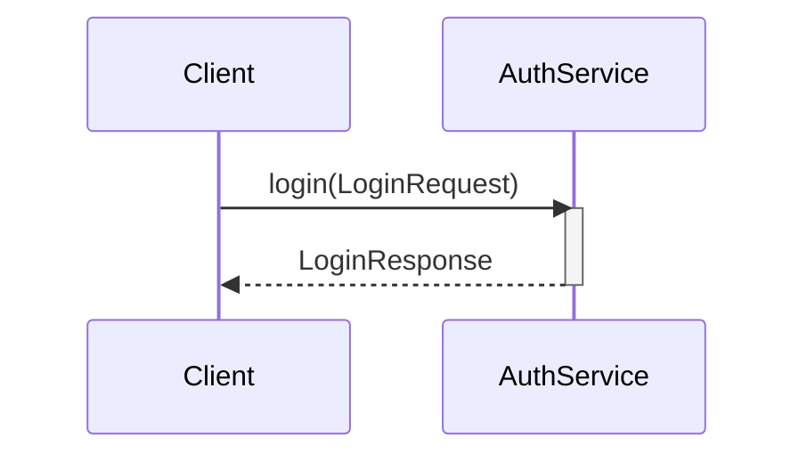

# Mermaid Sequence Diagram

## Participants

- Prefer explicit, semantic participants when order or shape matters:
	- `actor User`: human or external actor
	- `participant API@{ "type": "boundary" }`: interface or system boundary
	- `participant Auth@{ "type": "control" }`: orchestration/control logic
	- `participant Session@{ "type": "entity" }`: domain entity
	- `participant DB@{ "type": "database" }`: database
	- `participant Cache@{ "type": "collections" }`: collection/store
	- `participant Queue@{ "type": "queue" }`: queue/broker

## Function / RPC

- Use `->>` and function naming: `login(LoginRequest)`
- Returning calls use `-->> LoginResponse` and wrap callee execution with `activate`/`deactivate`.

Example:

## Event

- Use `--)` and message naming: `LoginResponse`
- When the receiver reacts to the event, wrap the reaction with `activate`/`deactivate`.
- Events have no return by definition

## Control Flow

- For non-linear behavior, use control blocks instead of flattening:
	- `alt` for mutually exclusive branches
	- `opt` for optional behavior
	- `loop` for repeated interactions
	- `break` for exceptions, aborts, or early termination

## Readability

- If multiple software modules run on the same server or physical device, group them in a Mermaid `box`
- Use `Note right of Participant: ...` or `Note over A,B: ...` for assumptions, invariants, constraints, or non-obvious context.
- Use `autonumber` when text will reference a specific message; omit it otherwise.
